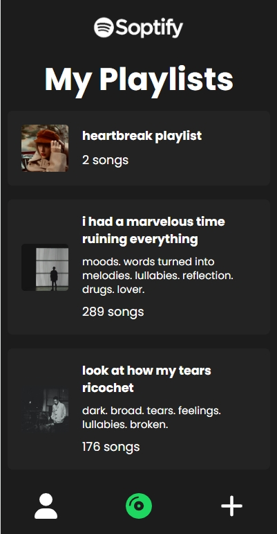
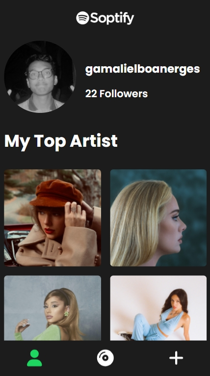
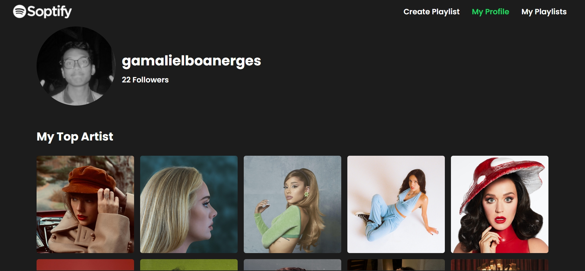
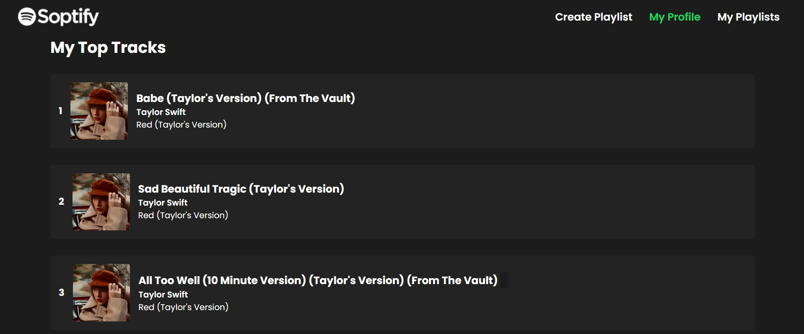
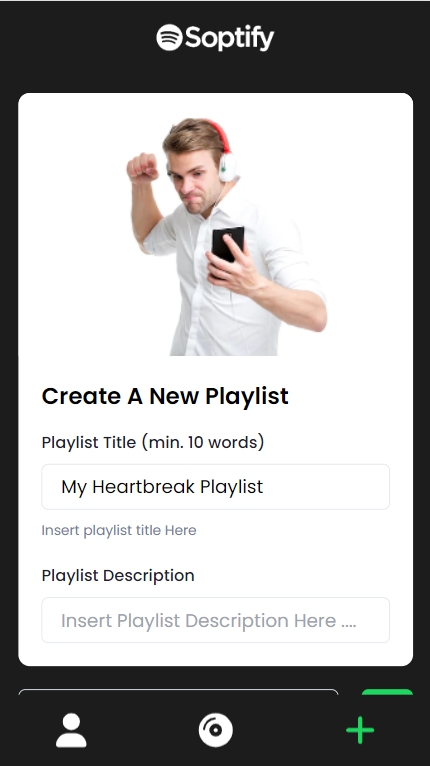
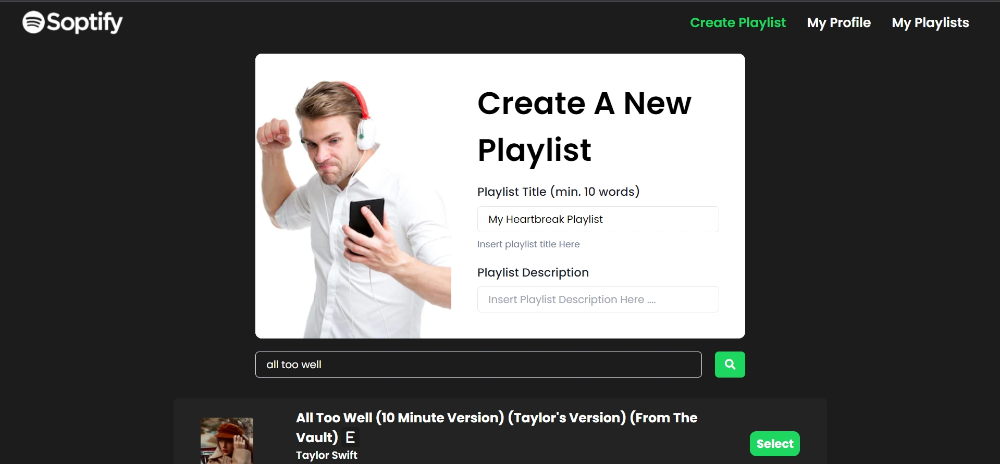
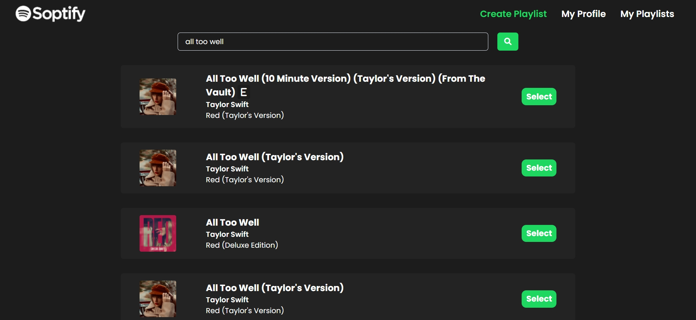

[SOPTIFY by Ara Gamaliel Boanerges](public/img/logo.png)

# **SOPTIFY by Ara Gamaliel Boanerges**

## About Soptify

Soptify is a Spotify-replica application, created by Ara Gamaliel using ReactJS and Spotify API. It will connected to your Spotify account. In this app you can see your playlists as well as the tracks in each playlists, you can also create a new public playlist and see your top artists and top tracks as well. You can experience the app [here](https://soptifygamaliel.vercel.app/)

**Soptify is created only by [Ara Gamaliel Boanerges](www.gamalielara.com)**

## Features in this app

Soptify is created using **ReactJS** with [Create React App](https://reactjs.org/docs/create-a-new-react-app.html) and **is fully written in [TypeScript](https://www.typescriptlang.org/)**. This app also uses [**Chakra UI**](https://chakra-ui.com/) to build modern form to create playlist and in general this app uses [**Tailwindcss**](https://tailwindcss.com/) as the CSS framework. Some features in this app includes **Redux (using [Redux Toolkit](http://redux-toolkit.js.org/))** to store search songs query, authentication token, and selected songs.

Soptify has in general five pages:

1. The login page
2. The authorization page. Once you click login, you will be directed to this page and you can start using the app
3. Profile page. In this page you can see your Spotify profile, artists whose music you love to hear the most as well as your most streamed tracks in Spotify
4. Create Playlist page to create a new playlist
5. Your playlist page to see your playlists as well as the tracks

## What's So Special about this app?

1. It is fully responsive! You can open this web app in laptop, phone, tablet, or whatever device you want
2. Not only can you see your playlists and modify them, this application allows you to see your favorite artists and tracks!
3. Modern UI and style created using Chakra UI and Tailwindcss
4. Cool user experience! This app uses animated skeleton loading, so this app would not be boring if you have bad signal!
5. This app passes two types of testing: the unit testing and mocking api. This feature is done by Jest and MSW ([Mock Serve Worker](https://mswjs.io/))

## Preview


|  |  |

|  |  |


## How To Run

You can see the live version of the app [here](https://soptifygamaliel.vercel.app/)
But, if you want to run the app on your local server:

1. Clone this code repository
   `https://github.com/gamalielara/gengigih-hw.git`
2. Open the terminal and install all the NPM packages
   `npm install`
3. Add your spotify key and user ID in your .env file

```bash
    REACT_APP_USER_ID=yourid
    REACT_APP_SPOTIFY_KEY=yourkey
```

4. Run the app
   `npm run start`
5. To run the test, type this in your terminal
   `npm run test`
